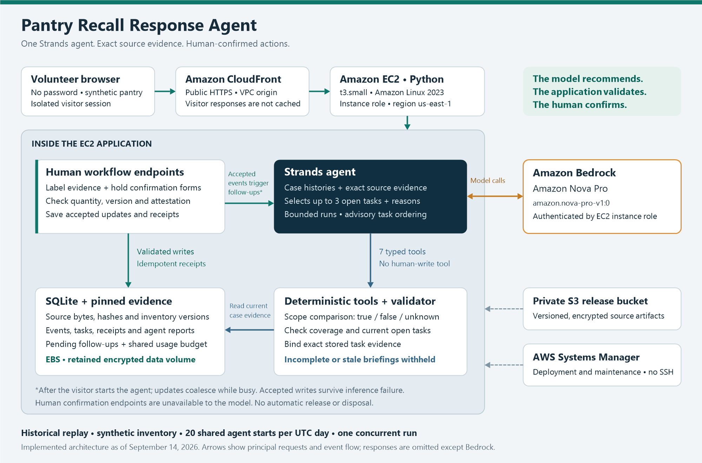

# Pantry Recall Response Agent

An AI-assisted recall workflow for community food pantries, built with
**Strands Agents, Amazon Bedrock and Python**.

A recall notice identifies a product; a volunteer still needs to find the right
stock, inspect its labels and record what happened next. Pantry Recall connects
those steps: the agent investigates inventory, asks for missing evidence and
revisits open work after a person confirms an action.

**[Live demo](https://d1vhm9p26zmdc7.cloudfront.net)** ?
[Walkthrough](docs/submission/JUDGE-GUIDE.md) ? [Evaluation evidence](docs/submission/EVIDENCE.md)

The public demo requires no password or visitor AWS account. It uses historical
recall notices and a separate synthetic pantry for each visitor.

## Overview

The system combines:

- **Source-grounded matching:** pinned notices, exact evidence spans and reviewed
  product scope. Missing identifiers remain unknown rather than becoming mismatches.
- **Agent-directed investigation:** Nova Pro uses seven typed tools to compare
  inventory, inspect histories and recommend up to three next checks.
- **Event-triggered follow-ups:** accepted label evidence and hold receipts
  prompt a new briefing after the first manual start.
- **Human-confirmed actions:** separate endpoints record quantities and receipts.
  The agent cannot confirm that a volunteer physically handled stock.

For example, four boxes with a missing printed code need inspection. Supplying a
matching code resolves identification, but leaves the hold task open. Confirming
two boxes leaves two outstanding; confirming the remainder closes that hold and
returns the agent to other open work.

## Architecture



| Layer | Implementation |
| --- | --- |
| Investigation | Strands Agents SDK with Amazon Nova Pro on Bedrock |
| Scope and action rules | Python comparators and validated workflow transitions |
| Persistence | SQLite events, evidence versions, tasks and human receipts |
| Interface | Python HTTP service with HTML, CSS and JavaScript |
| AWS hosting | EC2 behind CloudFront HTTPS; encrypted EBS; private S3 release bucket; IAM instance role and Systems Manager |

The model chooses which histories and tasks to investigate. The application
checks coverage, current state and quantities, then attaches the selected tasks'
exact stored evidence. Details: [agent design](docs/AGENT-ROLE.md) and
[deployment guide](docs/DEPLOYMENT.md).

## Repository layout

```text
pantry_recall/
  agent.py          Strands agent and tool wrappers
  matching.py       Pearl Milling scope comparisons
  jif.py            Jif scope comparisons
  store.py          Persistent evidence, tasks and receipts
  workflow.py       Evidence updates and human confirmations
  web.py            Web server
  static/           Browser interface
fixtures/           Pinned sources, synthetic stock and frozen expectations
tests/              Unit tests and stubbed SDK integration tests
tools/              Acquisition, deployment, verification and benchmark tools
deployment/         AWS bootstrap script
docs/               User guide, architecture, operations and agent evidence
evaluation/         Results summary and downloadable benchmark archive link
pyproject.toml      Dependencies and evaluation group
uv.lock             Locked dependency versions
```

## Setup

Requirements: **Python 3.11+** and **[uv](https://docs.astral.sh/uv/)**.
Local live inference also requires an AWS profile with Bedrock access to
`amazon.nova-pro-v1:0` in `us-east-1`.

```sh
git clone https://github.com/shinushibu17/pantry-recall-response-agent.git
cd pantry-recall-response-agent
uv sync --frozen
```

Set your AWS profile before starting the server. In PowerShell:

```powershell
$env:AWS_PROFILE = "your-profile"
$env:AWS_REGION = "us-east-1"
```

In Bash or Zsh, use `export AWS_PROFILE=your-profile` and
`export AWS_REGION=us-east-1`. Local inference uses your AWS account; the hosted
demo uses its instance role. No AWS access is needed for the offline tests.

## Running the app

```sh
uv run --frozen python -m pantry_recall.web
```

Open **http://127.0.0.1:8080**:

1. Select **Start recall agent** and inspect the comparisons and next checks.
2. Use **Label inspection ? Fill demo inspection** to supply the missing code.
3. Record a simulated two-box hold using the separate human confirmation form.
4. Confirm the remaining two boxes and inspect the event history and next briefing.

All stock and actions are synthetic. The shared public demo permits 20 agent
starts per UTC day and one concurrent run. Pause follow-ups when finished.

## Evaluation results

Run the test suite, both recall fixtures and workflow checks without model calls:

```sh
uv run --frozen --group evaluation python -m pantry_recall.evaluate --tests
```

| Evaluation | Observed result |
| --- | --- |
| Automated tests | **165 passed**: 118 pantry tests and 47 benchmark harness tests |
| Frozen recall scenarios | **18/18**: eight Pearl Milling and ten Jif cases |
| Recorded public agent workflow (September 13, Nova Lite) | **4/4 stages completed**, with eight comparisons per stage |
| Nova Pro upgrade | **8/8 local stages** across two replays; **4/4 public stages** after deployment |
| Action confirmation boundary | Two simulated human receipts; **zero agent confirmations** in the recorded workflow |

### How evaluation changed the agent

| Finding | Change | Follow-up result |
| --- | --- | --- |
| The first Jif run skipped scope comparisons: **0/10 executed** | Added one bounded continuation naming missing tools and stock IDs | Forced SDK tests cover recovery; the later live run completed **10/10** without needing the continuation |
| A browser run repeatedly invented citation identifiers and exhausted its call limit | The agent selects existing task IDs; the application attaches exact stored evidence | The same previously failing session completed without a reset; the subsequent four-stage public check also completed |

The classification evaluation also informed a production upgrade: **Nova Pro**,
explicit task-type guidance, and case-linked retrieval of raw stock fields and
exact source excerpts. Stock names are read alongside complete label conditions;
shared branding or ingredients cannot establish a match. The agent still selects
existing task IDs, and deterministic tools retain authority over findings.

Early upgrade checks exposed a 12-call limit and malformed model tool output.
A reproduced recovery sequence now fits a bounded **16-model-call / 20-tool-call**
allowance. Nova uses greedy decoding and a 3,072-token output limit; model-output
errors are distinguished from access failures. Two subsequent four-stage local
replays passed, followed by all four stages on the deployed public demo. These are regression checks, not a measured reliability gain;
Nova Pro was slower than the Lite baseline in these observations.

These checks show how concrete failures changed the agent interface and execution
controls. The Jif rerun alone does not establish a causal reliability gain, and
no volunteer time savings or general success rate has been measured. Original
failures and subsequent checks remain in the [evidence record](docs/submission/EVIDENCE.md).

### Separate classification benchmark

On all **997 released SemEval test reports**, the best completed ST1 composite
increased from **0.5669** with the Nova Lite baseline to **0.7892** with Nova Pro,
training-example retrieval and full training-derived taxonomy guidance. A later
Nova Pro/DeepSeek combination scored **0.8073 on validation only**; it has no
test result.

SemEval evaluates report classification; the deployed agent uses reviewed recall
scope and tools to investigate inventory. The benchmark informed model selection and context design; the actual pantry
workflow checks determined whether those changes could be deployed. Production
context uses pantry task definitions and saved evidence, with no SemEval training
examples or category labels. ST1 is not an accuracy percentage or an agent-workflow score. The test set was
already exposed during development, and training/split overlaps limit
generalization claims. The
[benchmark summary](evaluation/README.md) links all results, protocols and raw
responses in the downloadable evidence archive.

## Scope and limitations

The prototype supports two reviewed product projections, not arbitrary notices
or a live recall feed. Exclusion from one recall is not a general safety
clearance. Confirmations are human assertions, and model reasoning remains
advisory. Independent expectation review, a new untouched recall evaluation and
a pantry usability pilot remain future validation.

## License

Project code is [Apache 2.0](LICENSE). Pinned recall sources retain their
attribution in the fixture reviews. SemEval data and derived materials have
[separate CC BY-NC-SA 4.0 terms](evaluation/DATA-LICENSE.md).
